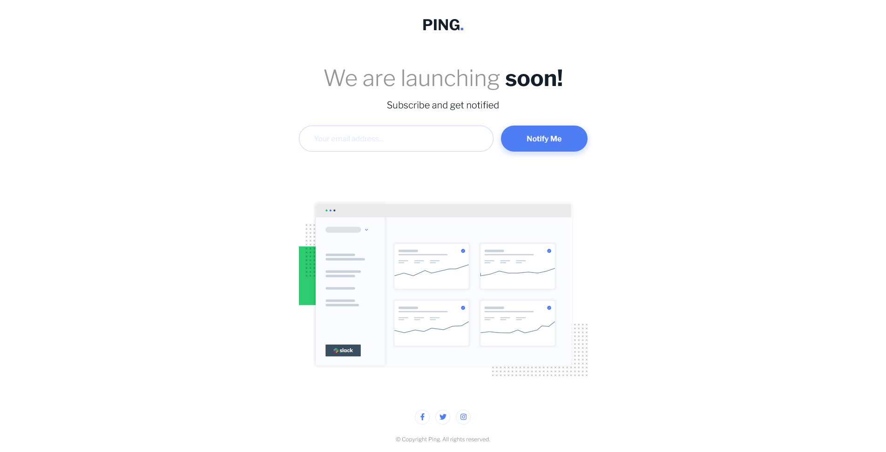

# Frontend Mentor - Ping Coming Soon Page Solution

This is a solution to the [Ping coming soon page challenge on Frontend Mentor](https://www.frontendmentor.io/challenges/ping-single-column-coming-soon-page-5cadd051fec04111f7b848da).

## Table of contents

- [Overview](#overview)
  - [The challenge](#the-challenge)
  - [Screenshot](#screenshot)
  - [Links](#links)
- [My process](#my-process)
  - [Built with](#built-with)
  - [What I learned](#what-i-learned)
  - [Continued development](#continued-development)
  - [Useful resources](#useful-resources)
- [Author](#author)

## Overview

### The challenge

Users should be able to:

- View the optimal layout for the site depending on their device's screen size.
- See hover states for all interactive elements on the page.
- Submit their email address using an `input` field.
- Receive an error message when the `form` is submitted if:
	- The `input` field is empty. The message for this error should say *"Whoops! It looks like you forgot to add your email"*.
	- The email address is not formatted correctly (i.e. a correct email address should have this structure: `name@host.tld`). The message for this error should say *"Please provide a valid email address"*.

### Screenshot

### Links

- Solution URL: [GitHub](https://github.com/wesleyjacoby/Coming-Soon-Page)
- Live Site URL: [GitHub Pages](https://your-live-site-url.com)

## My process

### Built with

- Semantic HTML5 markup
- CSS custom properties
- Flexbox
- CSS Grid
- Mobile-first workflow
- JavaScript

### What I learned

I learnt a lot with regards to JavaScript. I am slowly getting more comfortable with functions and manipulating the DOM, even though there is still a ton to learn.

The main take-away from this challenge was form validation. For example, disabling the default HTML validation using `novalidate`.

Then I used JavaScript and Regex to check the emaill address and from there manipulate the DOM.

I also figured out a far easier way to resize the social media icons.

### Continued development

There's still plenty to learn and I'll continue with more challenges that use JavaScript.

### Useful resources

- [rocoderes.com](https://rocoderes.com/client-side-form-validation-using-javascript/) - This website guided me with regards to form validation.

## Author

- Frontend Mentor - [@wesleyjacoby](https://www.frontendmentor.io/profile/wesleyjacoby)